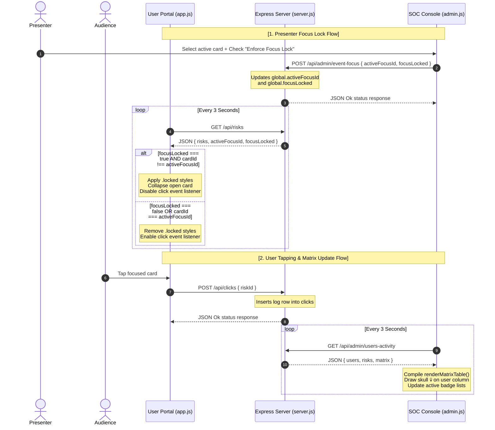

# Codebase Master Map & System Guide // RiskWatch

> [!IMPORTANT]
> **MAINTENANCE PROTOCOL**: This file serves as the definitive reference for the entire RiskWatch project. It must be read at the start of any feature modification and updated immediately whenever files are added, API routes are changed, database tables are modified, or UI states are refactored.

---

## 1. Directory Tree & File Roles

```
riskwatch-finance-awareness/
├── db.js                 # SQLite database initialization, table seeding, and .env credentials sync
├── server.js             # Express application server entry and routing middleware boots
├── design.md             # Theoretical architectural blueprint and layout specifications
├── APPLICATION_MAP.md    # [THIS FILE] Codebase structure, API routes map, and live sync flows
├── package.json          # Node dependency definitions and execution start scripts
├── .env                  # Active server variables (JWT secrets, admin configurations)
├── .env.example          # Template environment configurations
│
├── middleware/
│   └── auth.js           # JWT validation guard and admin authorization check middleware
│
├── routes/
│   ├── auth.js           # Authentication endpoints (/register, /login)
│   ├── risks.js          # User risks fetch endpoint (/api/risks)
│   ├── clicks.js         # User clicks scanner endpoint (/api/clicks)
│   └── admin.js          # Admin dashboard summary, matrix, timeline, and presenter sync routes
│
└── public/               # Frontend Client Assets
    ├── index.html        # Mobile terminal portal HTML template (Operator view)
    ├── admin.html        # Desktop SOC command console HTML template (Presenter view)
    │
    ├── css/
    │   ├── style.css     # CSS rules for mobile cards, open details, and focus lock templates
    │   └── admin.css     # CSS rules for desktop grid, cyber modals, and glowing user badges
    │
    └── js/
        ├── app.js        # Core user client (auth forms, dynamic locks, 3s loop sync)
        ├── admin.js      # Core admin client (radar chart, sticky matrix compiler, focus locks posts)
        └── chart.umd.min.js # Local Chart.js library bundle (offline safe)
```

---

## 2. Relational Database Schema (`db.js`)

SQLite is used for local data persistence. It consists of three tables:

```
┌────────────────────────────────────────────────────────┐
│ users                                                  │
├───────────────┬──────────────┬─────────────────────────┤
│ id            │ INTEGER (PK) │ Auto-incrementing       │
│ username      │ TEXT (UK)    │ Max 20 chars, unique    │
│ name          │ TEXT         │ Full display name       │
│ password_hash │ TEXT         │ Bcrypt hash (rounds=10) │
│ role          │ TEXT         │ 'admin' or 'user'       │
│ created_at    │ DATETIME     │ Default: CURRENT_TIME   │
└───────────────┴──────────────┴─────────────────────────┘
        │
        │ 1
        │
        └───┐
            │
            │ 0..*
┌───────────▼────────────────────────────────────────────┐
│ clicks                                                 │
├───────────────┬──────────────┬─────────────────────────┤
│ id            │ INTEGER (PK) │ Auto-incrementing       │
│ user_id       │ INTEGER (FK) │ References users(id)    │
│ risk_id       │ INTEGER (FK) │ References risks(id)    │
│ clicked_at    │ DATETIME     │ Default: CURRENT_TIME   │
└───────────▲────────────────────────────────────────────┘
            │
            │ 0..*
        ┌───┘
        │
        │ 1
┌───────┴────────────────────────────────────────────────┐
│ risks                                                  │
├───────────────┬──────────────┬─────────────────────────┤
│ id            │ INTEGER (PK) │ Auto-incrementing       │
│ slug          │ TEXT (UK)    │ E.g. 'digital-arrest'   │
│ title         │ TEXT         │ Heading title           │
│ short_desc    │ TEXT         │ Brief preview sentence  │
│ detail        │ TEXT         │ Full expanded description│
│ severity      │ TEXT         │ 'Low', 'Medium', 'High' │
│ icon          │ TEXT         │ Emoji glyph             │
│ sort_order    │ INTEGER      │ Presentation sequence   │
└───────────────┴──────────────┴─────────────────────────┘
```

---

## 3. Real-Time Interaction Flows



---

## 4. REST API Routing Contracts

### A. Client API Modules (`routes/auth.js`, `routes/risks.js`, `routes/clicks.js`)
- `POST /api/auth/register`: Receives `{ username, password, name }`. Returns `{ token, username, role: 'user' }`.
- `POST /api/auth/login`: Receives `{ username, password }`. Returns `{ token, username, role }`.
- `GET /api/risks`: Headers: `Authorization: Bearer <JWT>`. Returns `{ risks: [], totalUsers: N, activeFocusId: N, focusLocked: bool }`.
- `POST /api/clicks`: Headers: `Authorization: Bearer <JWT>`. Receives `{ riskId: N }`. Inserts click log in database.

### B. Command Console API Modules (`routes/admin.js`)
*All calls below require header `Authorization: Bearer <JWT>` containing an account role of `'admin'*
- `GET /api/admin/summary`: Returns JSON object `{ perRisk: [], perUser: [], totals: { total_users: N, active_users: N, total_clicks: N } }`.
- `GET /api/admin/users-activity`: Returns JSON object `{ users: [], risks: [], matrix: { "userId-riskId": { n: ClicksCount } } }`.
- `GET /api/admin/recent`: Returns the 15 most recent clicks with operator names and threat titles.
- `POST /api/admin/clear-logs`: Purges all rows from the `clicks` table in SQLite.
- `GET /api/admin/event-focus`: Returns current `{ activeFocusId: N, focusLocked: bool }` configuration variables.
- `POST /api/admin/event-focus`: Updates the in-memory global config variables.

---

## 5. Dual-Theme Engine

Both the user portal and admin dashboard support client-side theme selection:
- **Vercel Dark** (`default`): Slate panels (`#18181b`), deep violet text highlights (`#8b5cf6`), and clean white headers.
- **Cyberpunk Matrix** (`body.theme-matrix`): Dark obsidian panels (`rgba(10, 20, 13, 0.7)`), bright matrix green highlights (`#00ff66`), and monospace terminal fonts.
- **State Management**: Theme settings are persisted locally via `localStorage` keys `rw_theme` (user portal) and `rw_theme_admin` (admin console). Toggling the theme changes the class list on `document.body` and triggers a real-time redraw of the Chart.js grid coordinates to match the theme background.
