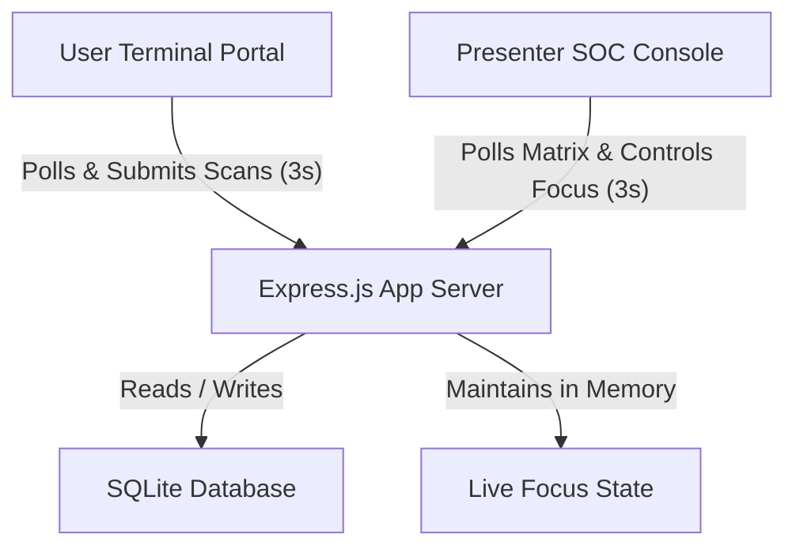
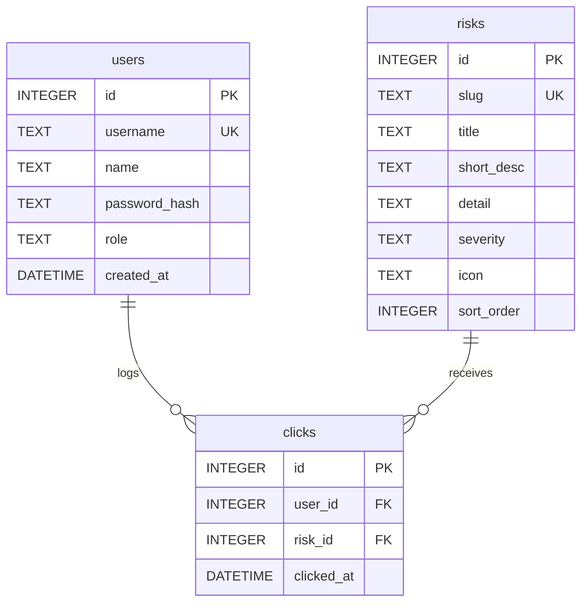

# System Design & Architecture Specification // RiskWatch

RiskWatch is a real-time, interactive cybersecurity-themed presentation platform designed to walk audiences through financial risk scenarios. The application allows users (referred to as **Operators**) to register and report if they have experienced specific financial threat vectors. The presenter (referred to as the **SOC Commander**) controls the presentation flow in real-time, syncs screens, and visualizes audience response telemetry.

---

## 1. System Architecture

RiskWatch follows a decoupled **Client-Server** architecture powered by an Express.js backend and light, high-frequency polling clients:

### Component Structure
- **Frontend clients**: Standard vanilla JavaScript, CSS, and HTML5 (no heavy frame-dependencies for quick load).
- **Backend API Server**: Node.js and Express.js providing authentication, user directory telemetry, and real-time event configuration.
- **Persistence**: SQLite database (`finrisk.sqlite`) for relational user records and threat vectors tracking.

---

## 2. Design & Aesthetic Systems

The application utilizes a dark **Cybersecurity Operations Center (SOC)** console aesthetic to resemble a command terminal.

### Style System Tokens
- **Color Palette**:
  - `Background`: `#0b0e14` (Deep obsidian black)
  - `Surface 1`: `#111622` (Sleek slate dark navy)
  - `Surface 2`: `#182030` (Medium terminal card navy)
  - `Accent / Cyan`: `#00f0ff` (Glowing active cyan)
  - `Success / Emerald`: `#00ff66` (Authorized scan emerald)
  - `Danger / Crimson`: `#ff3b6b` (Threat alert red)
  - `Text Standard`: `#eef1f8` (Crisp light-gray text)
  - `Text Dim`: `#8f9ab3` (Muted cyan-tinted description text)
  - `Border`: `rgba(0, 240, 255, 0.12)` (Cyber-grid cyan outlines)
- **Typography**:
  - Monospace (Terminal codes): `'IBM Plex Mono', monospace`
  - Tech headers: `'Space Grotesk', sans-serif`
  - Body text: `'Inter', sans-serif`

---

## 3. Database Schema

The SQLite schema is normalized into three relational tables: `users`, `risks`, and `clicks`.

### Table Specifications
1. **`users`**: Stores client registration details. Column `name` holds the audience member's full name, while `role` separates `'user'` from `'admin'`.
2. **`risks`**: Stores the 10 threat scenarios.
3. **`clicks`**: Junction table logging every scan event with timestamps.

---

## 4. Key Interactive Mechanics

### A. Presenter Focus Lock
To prevent audience members from exploring/clicking scenarios ahead of the presenter, the application utilizes a synchronized **Presenter Focus Lock**:
- **Admin Control**: The presenter selects the active scenario in their dashboard and checkmarks the `Enforce Presenter Focus Lock` switch. This state is written to the server using the `/api/admin/event-focus` endpoint.
- **Client Synchronization**: User portals query `/api/risks` every 3 seconds. If focus lock is active, all cards in the user portal that do not match the presenter's active focus are grayed out (`opacity: 0.45`), locked from expansion, and show `🔒 Presenter Focus Locked`.
- **Dynamic Collapse**: If an operator has a card expanded when the presenter locks focus to a different card, the client instantly collapses it, keeping the audience's screens synchronized.

### B. Live Audience Tally & Badging
When the presenter focuses on a card, the dashboard queries the client matrix to display a real-time tally of who has experienced it:
- Active participants who registered scans are rendered as glowing, pulsing cyan operator badges (`.operator-badge` with checkmark indicators).

### C. Threat Vector Matrix (Skull Matrix)
Under the main charts, a dynamic grid maps the entire audience's threat profile:
- **Horizontal Sticky Columns**: The first column displaying threat vector names has CSS sticky positioning (`position: sticky; left: 0`), allowing horizontal scrolling through numerous columns of operators without losing track of row titles.
- **Click Indicators**: Cells corresponding to a registered user scan are marked with a skull emoji (`💀`); unclicked cells display a subtle placeholder dot (`•`).

### D. Polar Area Radar Chart
A custom Chart.js radar displays operator names as polar segments:
- Segment colors are generated dynamically from an HSL harmonious blue/cyan palette.
- Clicking on an operator's segment triggers an **Operator Dossier Modal** popup, listing the timestamps and click counts of every threat card scanned by that operator.

---

## 5. Backend REST API Contracts

### Authentication Routing (`/api/auth`)
* `POST /register`: Registers a new user with `username`, `password`, and `name`. Returns a JWT token.
* `POST /login`: Validates credentials and returns JWT token + user roles.

### User Card Access (`/api/risks`)
* `GET /`: Fetches all 10 threat vectors, total user metrics, `activeFocusId`, and `focusLocked`. Requires a client JWT token.
* `POST /click`: Registers a scan event for the authenticated user and specified card ID.

### Admin Console Routing (`/api/admin`)
* `GET /summary`: Compiles aggregate click counts, active session sessions, and threat priority indices.
* `GET /users-activity`: Returns the complete user array, the 10 risks list, and the 2D user-risk scan matrix.
* `GET /recent`: Fetches a chronological stream of the latest 15 scan logs.
* `POST /clear-logs`: Purges the `clicks` table, clearing dashboard charts and matrices instantly.
* `GET /event-focus`: Returns current `{ activeFocusId, focusLocked }`.
* `POST /event-focus`: Updates current `{ activeFocusId, focusLocked }` in memory.
